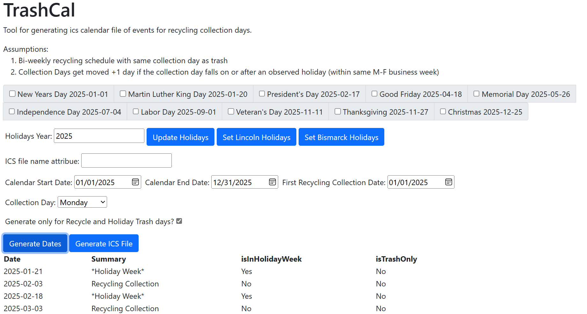

# TrashCal
Tool for calculating recycling collection date schedule with holiday adjustments and generates ics calendar files with the events for importing into your favorite calendar applications.  
            
## Assumptions:
1. Bi-weekly recycling schedule with same collection day as trash collection.
2. Collection Days get moved +1 day if the collection day falls on or after an observed holiday (within same M-F business week).

## How to use:
Just download/clone the repo to your system, then open index.html page in your browser (Ctrl+O).  Requires internet connection to download required jQuery and Bootstrap dependencies.

Holiday selections are currently defined as a hard-coded array at the top of the calgen.js file - add any additional required dates you need.  

## About:
A few years ago, I got tired of forgetting which week was recycling collection and having to go 2 weeks longer with a full can because I missed the collection day.  
I also had times where I forgot about a holiday and had our cans out a day early which meant I had to bring the can back in or walk further to take the trash out that night (in North Dakota winters, that can be more of a pain than you think).

At first I just manually created events in my calendar.  I got tired of doing that real fast, then I looked further into how calendar apps work and discovered ics files. Started with manually creating one to learn the format standard. Soon after, I wanted to create another file for friends/family in another area of the city with a different collection day. TrashCal was born as a barebones JavaScript function to speed up some of the process with generating the events - it logged the events to the browser's console and I copied them over to a file before figuring out the easy way to write to a file and download it through the browser with just JavaScript and no external tools.

January 2023, I was making updated 2023 files and decided to add some UI to allow setting the dates instead of being hard-coded.

December 2023 rolls around and it's time to create updated calendars for 2024.  Decided to extend the functionality a little further to make it even easier to generate more files for a sister city of where I live that has more collection days and they observe more holidays.

I was never really planning on opening this up as a public repo or doing much with it other than generating yearly files for myself. But as I am looking for future new gigs, I realized I am lacking in public portfolio projects showing that I really can write code. There's a lot of switching between vanilla JavaScript and jQuery functions, mostly because I was lazy at the moment and didn't want to look up the jQuery alternative to a native js function. I used Bootstrap just for a quick and dirty layout - looking for usable, not necessarily pretty.

Why JavaScript?  Because I've been working on large monolithic Java apps full-time++ for the past 13 years and it's nice to work with something simpler that I don't get to use much in my day job.  I didn't want to have to rely on spinning up an application server to run the code or have to worry about installing some other app to run from the command line or Docker containers, so I made it self-contained with just static html and JavaScript files.  Makes me think of the old days circa 1999-2000ish when I learned to develop simple websites in school using just a text file in notepad and Internet Explorer.

If you use this project's contents to make a boatload of money, remember your roots. At the very least, pay it forward some day.

## Version History
01/12/2025 - Updated from using hard-coded date values to using calculation algorithms based on provided year, month, week of month, and weekday values